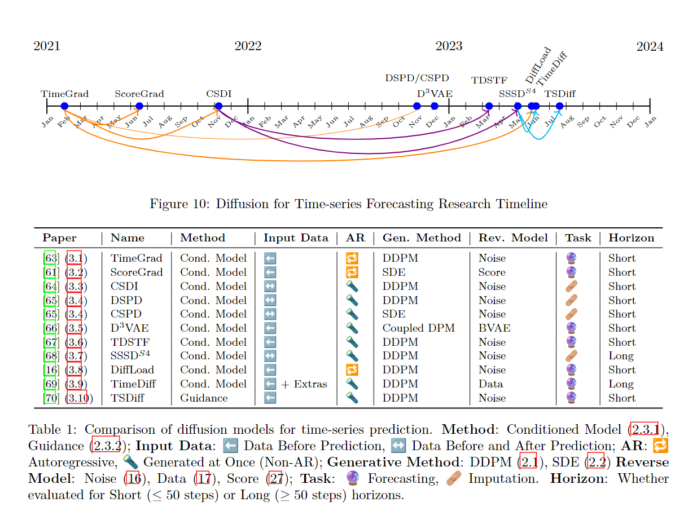

# The Rise of Diffusion Models in Time-Series Forecasting

This repository contains the complete LuaTeX source code and the final PDF of the literature survey, "The Rise of Diffusion Models in Time-Series Forecasting" authored by Caspar Meijer and Lydia Y. Chen. This comprehensive survey delves into the application of diffusion models in time-series forecasting, demonstrating state-of-the-art results in various fields of generative AI.



## Contributors
- Caspar Meijer, EEMCS Distributed Systems, Delft University of Technology, c.j.meijer-1@student.tudelft.nl
- Lydia Y. Chen, EEMCS Distributed Systems, Delft University of Technology, lydiaychen@ieee.org

---

## Cite
If the work has helped you in your endevors, or you use any of the latex illustrations / figures:

```
@misc{meijer2024rise,
      title={The Rise of Diffusion Models in Time-Series Forecasting}, 
      author={Caspar Meijer and Lydia Y. Chen},
      year={2024},
      eprint={2401.03006},
      archivePrefix={arXiv},
      primaryClass={cs.LG}
}
```

---

For any further questions or inquiries, please open an issue or contact Caspar directly.

---

Shield: [![CC BY-NC-SA 4.0][cc-by-nc-sa-shield]][cc-by-nc-sa]

This work is licensed under a
[Creative Commons Attribution-NonCommercial-ShareAlike 4.0 International License][cc-by-nc-sa].

[![CC BY-NC-SA 4.0][cc-by-nc-sa-image]][cc-by-nc-sa]

[cc-by-nc-sa]: http://creativecommons.org/licenses/by-nc-sa/4.0/
[cc-by-nc-sa-image]: https://licensebuttons.net/l/by-nc-sa/4.0/88x31.png
[cc-by-nc-sa-shield]: https://img.shields.io/badge/License-CC%20BY--NC--SA%204.0-lightgrey.svg
